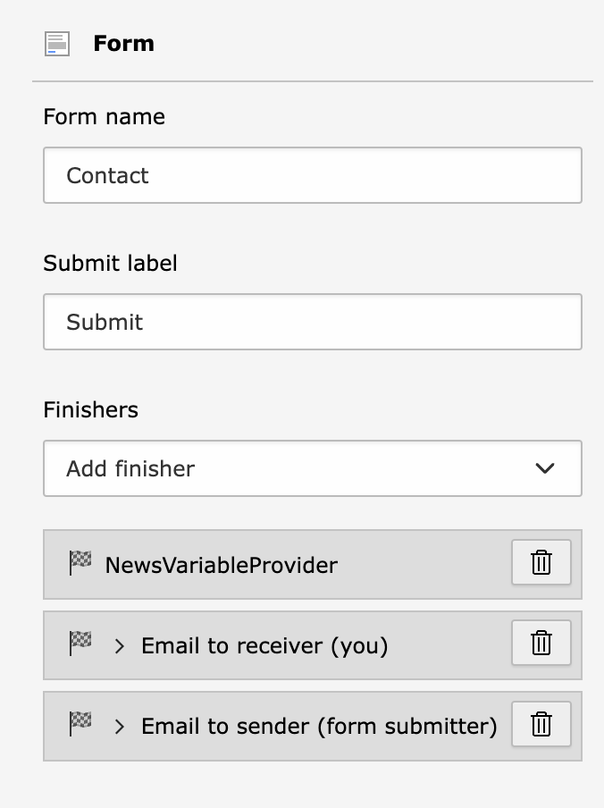

# TYPO3 Extension `news_form_fill`

This extension provides information of the news record (EXT:news) to the emails generated by EXT:form.

Typical use case: Imagine events based on news articles. Every article contains a link to a page with the form to be able to register.

## Installation

Install the extension with `composer req georgringer/news-form-fill`. 

## Usage

### Form Configuration

The newly available finisher needs to be placed **before** the email finisher(s).

Either use the UI as seen below or add the finisher manually in the yaml file

```yaml
finishers:
  -
    identifier: NewsVariableProvider
```



After that, place a hidden field in the form with the identifier `newsid`

```yaml
      -
        defaultValue: null
        type: Hidden
        identifier: newsid
        label: News
```


### Link to the form

Generate the link to the form with a link like this:

```
https://example.ddev.site/booking?newsid=123
```

You can now check if the prefill works by checking the source code of your page.
It should contain a hidden field with the news id.

```html
<input
        id="form-identifier-newsid"
        type="hidden"
        name="tx_form_formframework[form-identifier][newsid]"
        value="1" />
```

### Use the news information in the template

This extension registers a demo layout in the `BaseSetup.yaml` file

```yaml
TYPO3:
  CMS:
    Form:
      prototypes:
        standard:
          finishersDefinition:
            EmailToReceiver:
              options:
                templateRootPaths:
                  1714495718: 'EXT:news_form_fill/Resources/Private/Templates/Finishers/Email/'
            EmailToSender:
              options:
                templateRootPaths:
                  1714495718: 'EXT:news_form_fill/Resources/Private/Templates/Finishers/Email/'
```

Take a look at `Resources/Private/Templates/Finishers/Email/Default.html` to see how the news information is retrieved in the email.

Currently there is a hardcoded access to the following fields: uid, pid, title, teaser, bodytext.

# Thanks to

- Manuel Schnabel for your [extension](https://github.com/passionweb-manuel-schnabel/finisher-variable-provider) which I learned the most from and also took some code!
- Gernot Hofer for sponsoring the development of this extension
